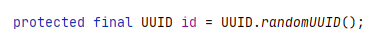
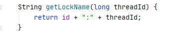
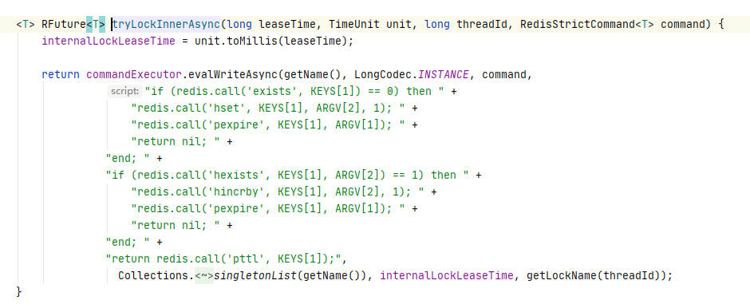
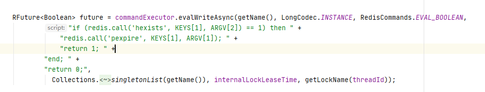
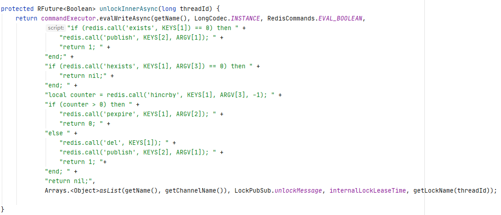
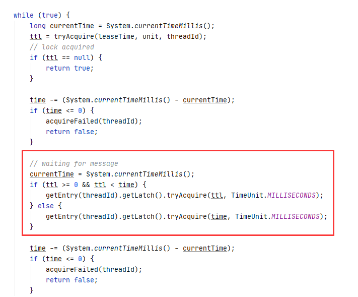

# Redis 分布式锁

锁是保存在一个共享存储系统中，可以被多个客户端访问和获取。

Redis 本身可以被多个客户端共享访问，正好就是一个共享存储系统，可以用来保存分布式锁。

Redis 的读写性能高，可以应对高并发的锁操作场景


## 单机锁和分布式锁区别


首先是单机锁，对于单机上多线程程序，我们可以用一个变量表示锁，例如0表示没有线程获取锁，1表示已经有线程获取锁。


看一段简单的代码

```
// 判断是否获取到锁
boolean isLock() {
    // 获取锁
    lock = lock()
    //判断锁
    if (lock == 0) {
        // 将锁变量设置为1
        lock = 1;
        return true;
    }
    return false;
}

// 释放锁
boolean releaseLock() {
    lock = 0;
}


if (isLock()){
    do something;
    releaseLock();
}
```


其实分布式锁也跟单机锁差不多，就相当于一个线程对应一个客户端。

分布式锁也是用一个变量来实现。客户端加锁和释放锁的操作逻辑，也和单机上的加锁和释放锁操作逻辑一致。通过锁的值判断是否获取到锁，同时业务处理完要释放锁。


分布式的场景下，锁需要有一个共享的系统维护，保证多个客户端可以访问、获取和操作锁。

加锁和释放锁的操作就变成了了读取、判断和设置锁变量值。


## 分布式锁的特点：

- 唯一值
- 所有客户端都能访问和操作


## 分布式锁需要满足的条件

- 互斥性。只有一个客户端能持有锁
- 不会发生死锁。客户端崩溃没事释放锁也能保证其他客户端获取锁
- 加锁和解锁必须是同一个客户端


## 分布式锁需要注意的问题

保证同一时间只有一个客户端获取到锁


## Redis 如何实现分布式锁


### 基于单个节点的分布式锁

Redis中可以使用键值对保存锁变量，再接收和处理不同客户端发送的加锁和释放锁的操作请求。


如同单机锁一样，我们约定好锁的key 值，这样不同的客户端都可以访问和操作锁变量。例如 key 为 redis_lock，value 为0 表示没有客户端获取锁，value 为1表示有客户端获取到了锁。

我们假设有客户端A和客户端B同时发起加锁请求，因为Redis 使用单线程处理请求，即使A和B同时发起加锁请求，Redis 也会串行处理，即同一时间确保只有一个客户端获取到锁。


我们来看一下获取锁即加锁的操作，这个是之前单机获取锁的代码，分布式锁的获取基本也是按照这个逻辑，我们看看如果是这个逻辑分布式锁会出现什么问题，lock() 方法获取锁变量，即对应着Redis 中 get 命令通过key获取值，而将锁变量设置为1则是Redis 中的set 命令。

记得我之前说过Redis 是单线成处理请求把，这个时候大家应该能想到会出现什么问题，就是在获取锁变量的时候，A客户端和B客户端同时发起获取锁的请求，这个时候A和B获取到的锁变量都是0，这就会导致A和B同时获取到锁。接下来的我们要解决的问题就是如何保证获取锁的原子性，其实也就是如何保证Redis 的原子性。

```
//获取锁
boolean getLock() {
    // 获取锁变量
    lock = lock()
    //判断锁
    if (lock == 0) {
        // 将锁变量设置为1
        lock = 1;
        return true;
    }
    return false;
}
```


```
//获取锁
boolean getLock() {
    // 获取锁变量
    lock = lock("redis_lock") // 对应Redis 中 get 命令
    //判断锁
    if (lock == 0) {
        // 将锁变量设置为1
        setLock("redis_lock", 1); // 对应Redis 中set 命令
        return true;
    }
    return false;
}
```

#### 保证Redis 原子性

保证Redis 的原子性有两种方法，一个是单命令操作（2.6.12），另一个就是lua 脚本（2.6）。

首先是单命令操作，Redis 中提供了 setnx 命令，作用是命令执行时会判断键值对是否存在，如果不存在就先创建键值对，然后再设置value。获取锁使用了setnx 之后，释放锁也得做一下改变，即释放锁的时候不是将锁变量设置为0，而是直接在Redis 中使用del 删除锁。

```
setnx key value // 设置成功返回1， 设置失败返回0
```

这个时候我们的代码就变成了下面这个样子

```
// 获取锁
boolean getLock() {
    // 获取锁变量
    flag = setnx("redis_lock", 1) // 对应Redis 中 get 命令
    //判断锁
    if (flag == 1) {
        return true;
    }
    return false;
}

// 释放锁
boolen releaseLock() {
    del("redis_lock")
}
```


#### 设置锁过期时间

好了，这下就改造成功了，然后我们再来看看会有什么问题，还是这段代码，假设处理数据的时候发生了异常，导致锁一直没有被释放，其他客户端就无法获取到锁。这个解决起来比较简单，就是给锁设置一个过期时间就好了，恰好Redis 是支持对key 设置过期时间的。

```
if (getLock()){
    do something; // 假设这里发生异常
    releaseLock();
}
```

这时候Redis 指令就变成这样了。

（2.6.12）

```
set key value nx px 10000
```


#### 防止锁被误删


解决了过期时间的问题，这时候setnx 还是会存在一个问题，因为之前我们是用value 值来判断是否获取锁，使用了setnx之后是用key是否存在判断是否获取锁，这就会导致一个问题，key 被删了怎么办。

即假设客户端A获取到锁之后处理数据超时了锁被删了，这时候客户端B加锁成功，而客户端A处理完数据会将之前的锁删除（这个时候已经不是A设置的锁了，而是把B设置的锁删了），客户端C再进行加锁就会成功，这时候B和C都会持有锁。

这个时候就要区分下是哪个客户端上的锁，解决办法就是通过value 值去判断。这里我们不再将value 的值设置为0或1，而是设置成可以标识客户端的唯一值，例如客户端A就设置成A，客户端B就设置成B，这样在删除锁的时候先进行判断是不是当前客户端上的锁，是的话才能进行删除，这样就能有效解决上面的问题。

**即谁上锁谁才能解锁**

释放锁的代码就变成了这样：

```
// 释放锁
boolen releaseLock() {
    if ("A" == getLock("redis_lock")) {
        del("redis_lock")
    }
}
```


获取锁 lua 脚本：

```
"if redis.call('setnx',KEYS[1],ARGV[1])==1 then\n" +
"    if redis.call('get',KEYS[1])==ARGV[1] then\n" +
"        return redis.call('expire',KEYS[1],ARGV[2])\n" +
"    else\n" +
"        return 0\n" +
"    end\n" +
"else\n" +
"end";
```


释放锁 lua 脚本:

```
// 释放锁 比较value是否相等，避免误释放
"if redis.call(\"get\",KEYS[1]) == ARGV[1] then\n" +
"    return redis.call(\"del\",KEYS[1])\n" +
"else\n" +
"    return 0\n" +
"end";
```


```
redis-cli --eval script.script lock_key , unique_value
```


```
ttl key // 查看过期时间
```


上面所实现的基于单节点的redis 分布式锁基本上在大部分情况下都可以使用了，但是还是会有一些缺点，例如不支持阻塞等待，不支持重入锁。当然这两个问题也是可以解决的，例如对于阻塞等待设置一个阻塞时间，在阻塞时间内不停的循环获取锁，对于重入锁可以将锁的过期时间设置大一点。


#### Redission


阻塞等待、可重入


唯一值





trylock() lua脚本



如果锁不存在设置锁，同时设置锁的过期时间（internalLockLeaseTime），return

如果锁存在，判断是否属于自己加的锁，如果是则将值加1，同时将重新设置过期时间（重入锁）。这一步主要是为了解决业务处理时间大于锁的过期时间问题。

如果锁存在并且不属于自己加的锁则返回锁目前剩余的过期时间。


重入锁：重入多少次就得解锁多少次




unlock() lua脚本



如果锁不存在，publish 发送锁已经解锁的消息。

如果锁存在，判断是否属于自己创建的锁，不属于自己的锁直接返回不处理。

如果属于自己的锁，将值减1并返回，判断该值如果大于0，重新设置锁的过期时间，否则删除该锁并发布锁已经解锁的消息。


不停请求锁的代码（阻塞等待）：





### 基于多个节点的分布式锁

基于单个节点的分布式锁，当该节点出现故障就会导致锁丢失，即使使用了哨兵保证高可用，也会有锁丢失的情况，例如从节点还没同步主节点的锁这时候主节点发生故障，从节点升级为主节点，这时候的主节点锁是不存在的。


#### RedLock

保证高可用

redlock 是Redis 作者 antirez 提出的算法，在Redis的分布式环境中，我们假设有N个Redis master。这些节点**完全互相独立，不存在主从复制或者其他集群协调机制**。**当且仅当从大多数**（N/2+1）**的Redis节点都取到锁，并且使用的时间小于锁失效时间时，锁才算获取成功**。


## 总结

- 原子性
  - 单命令
  - lua脚本
- 设置过期时间
- 设置唯一值
- redission
- 多节点开采用redlock


要避免的主要问题：防止同一时间多个客户端获取到锁，同一时间只能一个客户端获取到锁


